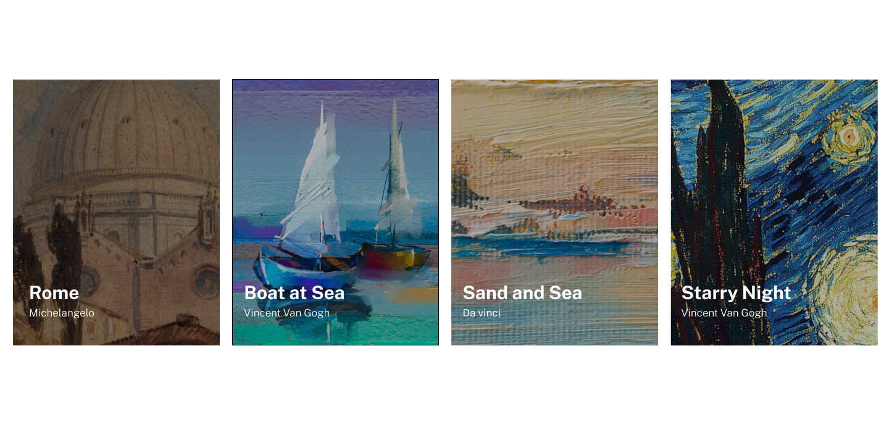
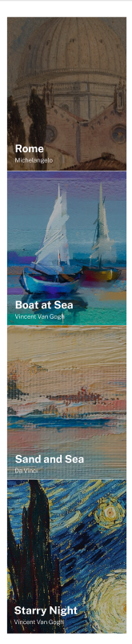
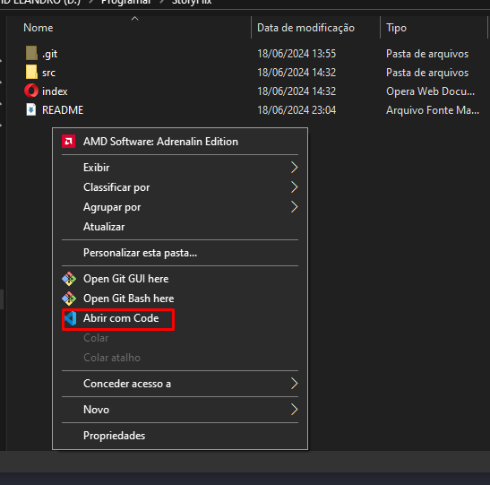

# Exercício HTML + CSS Avançado - Lista de Imagens

**Descrição da tarefa**: Esse exercício é criar uma lista de imagens para ser aprimorado as habilidades de posicionamento de elementos usando flexbox. (responsivo também)

Layout esperado para desktop:



Layout esperado para mobile:



## Tecnologias utilizadas
- HTML
- CSS

## Como utilizar?

1- Clone o projeto selecione a pasta aonde quer que ele fique
```
git clone url do projeto
```
2- Acesse a pasta do projeto e abra com o code (VSCode)

